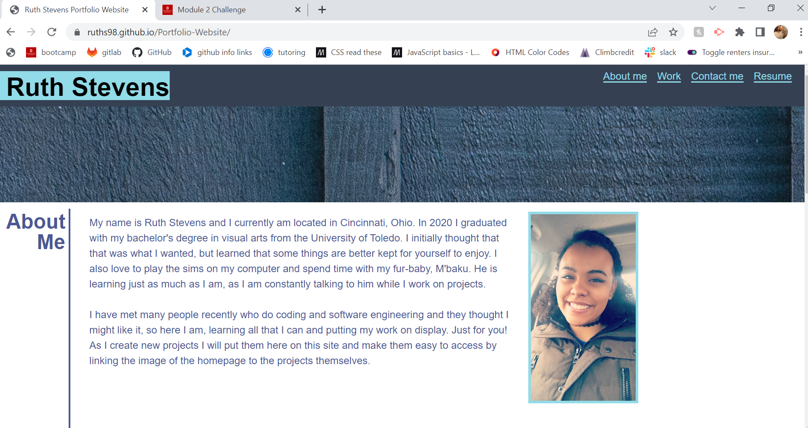
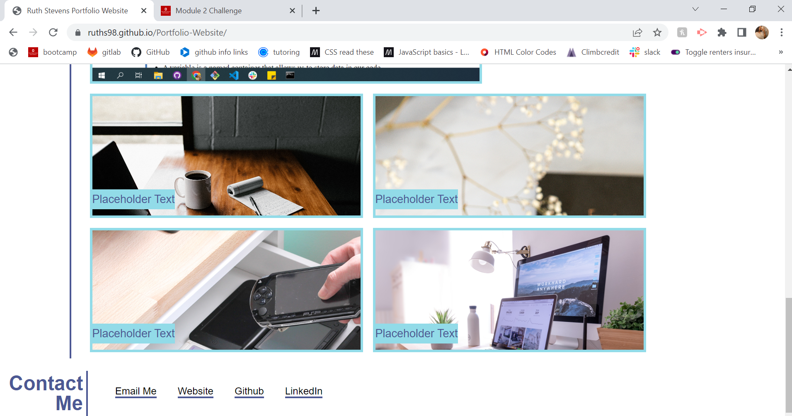
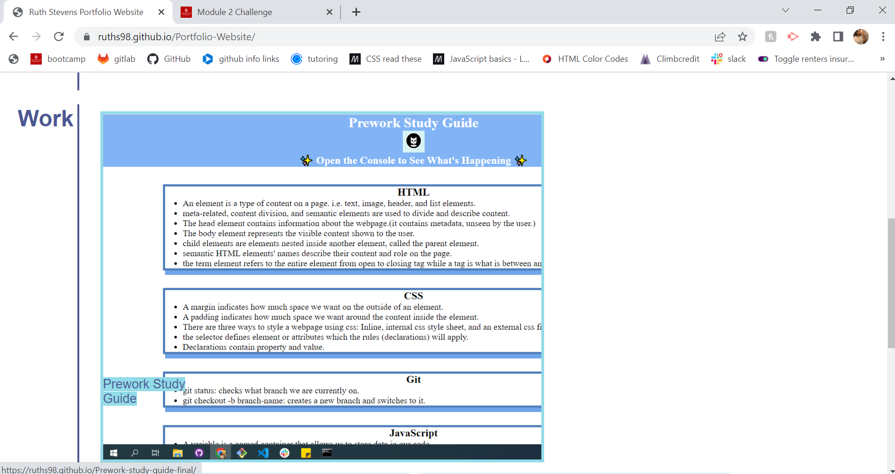

# Portfolio-Website

## This website serves as a professional portfolio.

This website was created using HTML and CSS. The purpose of this project is to show my work as I continue learning full stack web development and will be added to over as I continue to learn and grow. Each project included in the portfolio site is meant to showcase various skills I have aquired and demonstrate my competence to hopefully win over future employers.

## Installation

No installation is required. 

## Usage

To access the website, use the following url:
https://ruths98.github.io/Portfolio-Website/

